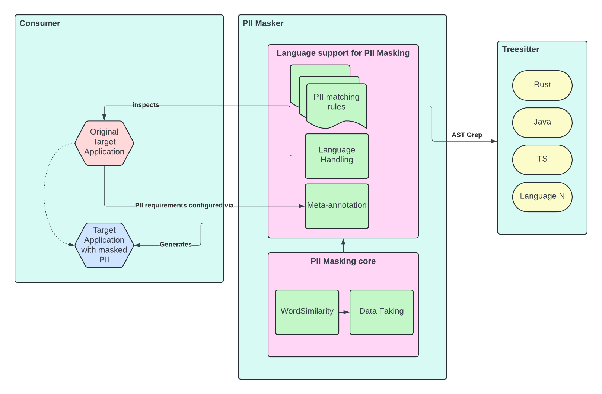

# PII Masker



## Overview

This tool is designed to mask Personally Identifiable Information (PII) in code, specifically in unit tests, using Abstract Syntax Tree (AST) matching instead of regular expressions (Regex).
By analyzing the code at the AST level, the tool can accurately identify and mask PII without the limitations and complexities of Regex patterns. While the core use case is to conceal PII included in test fixtures by identifying and masking PII usages within unit tests, the tool is extensible and can be applied to various scenarios beyond this use case.

## Features

- **PII Masking**: The tool scans unit tests for PII data such as social security numbers, email addresses, phone numbers, etc., and masks them to protect sensitive information.
- **AST Matching**: Utilizes declarative AST matching techniques to precisely identify PII patterns in the code, ensuring accurate detection and masking.
- **Configurability**: Users can configure the tool to specify the types of PII to mask and customize the masking format.
- **Report Generation**: Generates a report detailing the PII found and the corresponding masked values for auditing and compliance purposes.
- **Multi-Language Support**: Supports 20+ programming languages for comprehensive PII detection and masking across various codebases.

## Benefits of AST Matching Approach

1. **Precision**: AST matching allows for precise identification of PII patterns in the code, reducing false positives and negatives commonly associated with Regex patterns.
2. **Context Awareness**: AST matching considers the context of the code, enabling more accurate detection of PII based on the code structure and semantics.
3. **Maintainability**: AST matching is more maintainable than complex Regex patterns, as it aligns with the code structure and can adapt to changes in the codebase.
4. **Extensibility**: The tool's architecture is extensible, allowing for customization and extension beyond the core use case of masking PII in unit tests. Users can adapt the tool to suit various
scenarios and integrate it into different workflows.
  
By leveraging AST matching in a declarative manner and supporting multiple programming languages, this tool provides a robust solution for masking PII in codebases, offering enhanced data protection and
compliance capabilities that can be extended to diverse use cases.

## Usage

To mask Personally Identifiable Information (PII) within a specified test environment, you can use the PII Masker tool by providing the path to the unit test source file, the corresponding fixture file, and the size of the word pool to use for each category. For example, the following command will mask the PII found in `student.rs` and `student.yaml` files with a word pool size of 10,000 words per category:
```shell
$ pii-masker --source-path example/student.rs --fixture-path example/student.yaml --word-pool-size 10000
```
By specifying the source path for the unit test source file, the fixture path for the corresponding fixture file, and customizing the word pool size, you can effectively mask PII data within your test
environment using the PII Masker tool.

